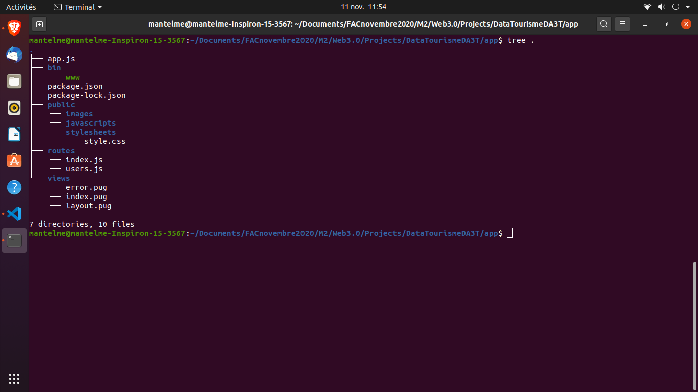
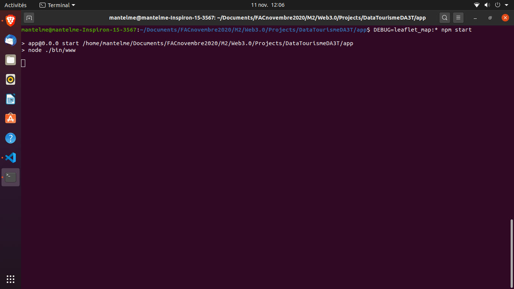
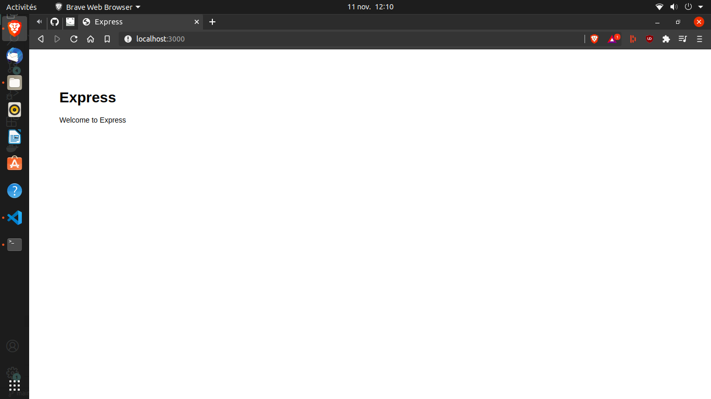
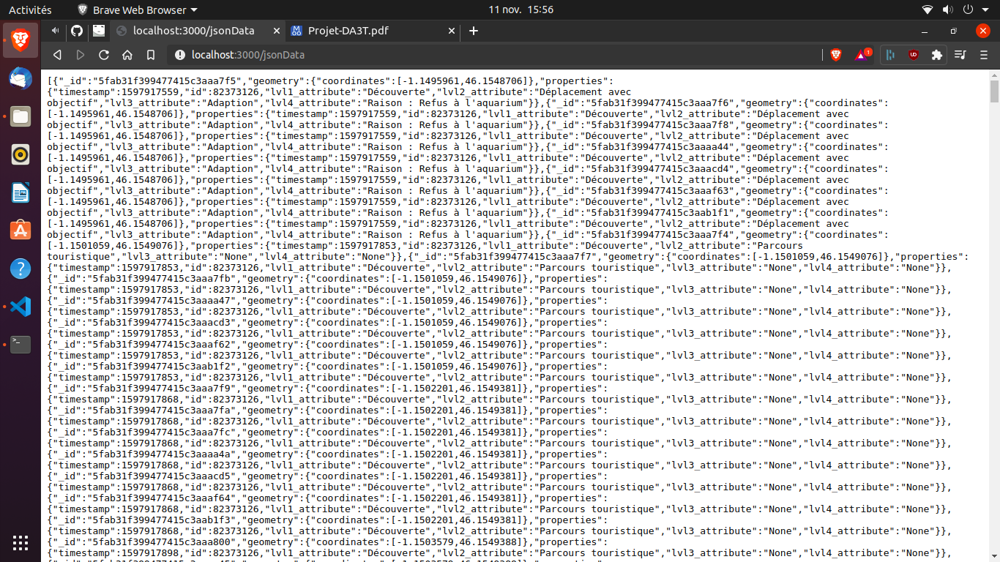
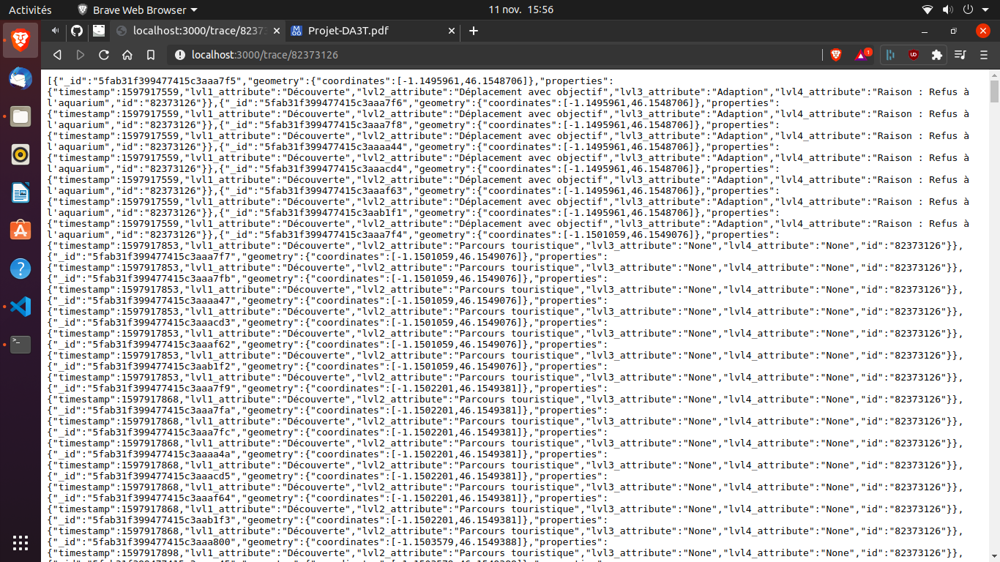
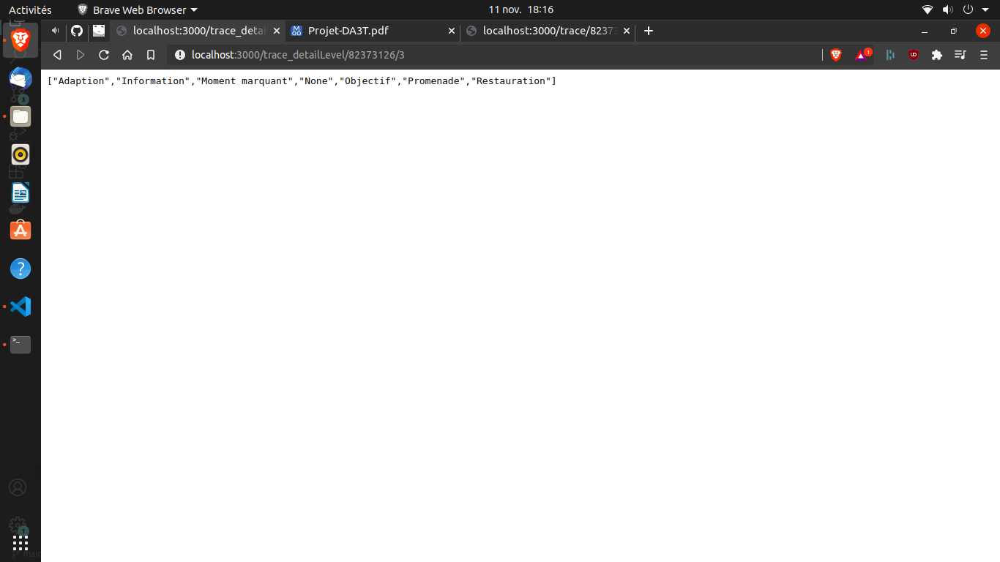
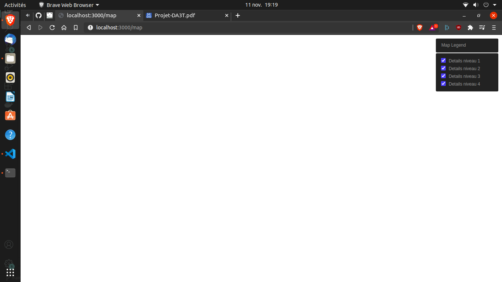

# WEB 3.0 - Données Touristique DA3T

### ANTELME Mathis

## Objectif du projet

> L'objectif de ce projet est de concevoir un outil de visualisation des traces enrichies sémantiquement dans le but de les éditer.

On attend les fonctionnalités suivantes:

1. **Chargement des traces** - Les traces sont disponibles au format *json*, cependant certaines traces ne sont pas valides (un `timestamp` négatif, les champs `id` et `id_user` sont équivalent, etc...);
2. **Sélection et affichage des traces** - L'outil devra permettre de sélectionner une ou plusieurs traces, puis de les afficher sur une carte de la ville de la Rochelle;
3. **Sélection et affichage de POI de la ville de la Rochelle** - Il s'agira de récupérer les **POI** (*Point of Interest*) de la Rochelle à partir d'une ontologie existante sur le web, puis, de les proposer à l'affichage;
4. **Sélection et affichage d'enrichissement sémantique des traces** - L'enrichissement sémantique s'organise en différents niveaux hiérachiques. L'outil devra permettre de sélectionner *un ou plusieurs* niveaux à afficher;
5. **Export PDF** - L'outil devra proposer un export au format **PDF**;

## Choix techniques

Pour la réalisation de ce projet j'ai décidé d'utiliser une application **Nodejs** qui utilisera les technologies suivantes:

- **[Leaflet](https://leafletjs.com/)** - Une bibliothèque légère et open-source qui permet de d'afficher des points, lignes, tracés et polygonnes sur une carte (elle affiche aussi les POI par défaut);
- **[MongoDB](https://www.mongodb.com/fr)** - Une base de donnée **NoSQL** rapide et facile à initialiser qui permettera de stocker les données des tracés au format **[GeoJSON](https://geojson.org/)**;
- **[Pug](https://pugjs.org/api/getting-started.html)** - Un système de patron qui permet de générer du **HTML** à la demande afin de gérer le front-end de l'application;

## Mise en place de MongoDB

Afin d'utiliser **MongoDB** pour stocker les données **GeoJSON**, nous devons tout d'abord l'installer comme [recommandé](https://docs.mongodb.com/manual/tutorial/install-mongodb-on-ubuntu/). Une fois cela effectué, on l'activera comme n'importe quel service puis on s'y connectera avec les commandes suivantes: 

```bash
sudo systemctl start mongod.service # mise en route du service
mongo --host 127.0.0.1:27017 # connection a mongoDB
```

Une fois connecté à **MongoDB**, on initialisera une base de données nommée `dataTourismDA3T` avec la commande ci-dessous:

```nosql
use dataTourismDA3T;
```

## Nettoyage des traces

Les données fournies pour ce projet (ici présentes dans le répertoire `./data`), ne sont pas utilisable dans leur état actuel. En effet, les tracés non-enrichis ne sont pas au format **GeoJSON**, et certaines des entrées ne sont pas valides. 

Avant de pouvoir incorporer ces données dans **MongoDB**, il nous font donc les nettoyer, puis les convertir en un format exploitable.

### Tracés enrichis (`./data/enriched`)

Ces données sont celles qui nécessitent le moins de traitement. En effet, elles sont déjà au format **GeoJSON**, cependant **MongoDB** considère que le document n'est pas valide (cf: Figure 1). 


Afin de corriger cela, nous allons utiliser l'utilitaire **[jq](https://stedolan.github.io/jq/)** qui permet, entre autres, de compacter le document et de le rendre compatible avec **MongoDB**. Pour cela on va utiliser la commande suivante:

```bash
jq --compact-output ".features" raw_dataset.json > ../cleaned/enriched_dataset.geojson
```

Suite à cela, l'importation des données dans **MongoDB** se fera sans soucis avec la commande suivante:

```bash
mongoimport --db dataTourismDA3T -c enriched_traces --file "../cleaned/enriched_dataset.geojson" --jsonArray
```

On pourra s'assurer de l'importation correcte des données en nous connectant à la base de données `mongo --host 127.0.0.1:27017` et en entrant les commandes suivantes qui vont permettre de nous connecter et d'afficher la première entrée dans la collection:

```nosql
use dataTourismDA3T;
db.enriched_traces.findOne();
```


### Tracés non-enrichis (`./data/raw`)

Les données des tracés non-enrichis sont celles qui nécessite un nettoyage et une transformation au format **GeoJSON**. Heureusement pour nous, ce format n'est rien d'autre que du **JSON** avec certaines spécifications. Dans notre cas, les points enregistrés par l'application mobile doivent être stockés sous la forme suivante:

```json
{
    "type": "FeatureCollection",
    "name": "traces",
    "features": [
        {
            "type": "Feature",
            "geometry": {
                "type": "Point",
                "coordinates": [
                    50,
                    100
                ]
            },
            "properties": {
                "trace_id": 1,
                "timestamp": 100000
            }
        },
        {
            "type": "Feature",
            "geometry": {
                "type": "Point",
                "coordinates": [
                    150,
                    20
                ]
            },
            "properties": {
                "trace_id": 2,
                "timestamp": 1000999
            }
        }
    ]
}
```

Cependant les données doivent être nettoyées avant d'être transformées. En effet certains des `timestamps` sont négatifs, donc invalides, et une trace peut être identifiée par la clé `id` ou `id_user`. Nous devons donc renommer les clefs identifiant les traces en `id` afin de faciliter le traitement, puis sélectionner les objets donc les `timestamps` sont positifs.

Pour cela on va de nouveau utiliser `jq`:

```bash
.[] | with_entries( if .key | contains("id_user") then .key |= sub("id_user";"id") else . end) # permet de renommer les clefs 'id_user' en 'id'
| select(.timestamp>=0) # sélectionne uniquement les objets JSON dont le timestamp n'est pas négatif
```

Une fois ces données nettoyées, on peut les transformer avec `jq` et la syntaxe suivante (en assumant que vos données soient stockées dans `./data/raw/raw_dataset.json`):

```bash
jq '
{
    type:"FeatureCollection", 
    name:"raw_traces", 
    features:[
        .[] | select(.timestamp>=0) | with_entries( if .key | contains("id_user") then .key |= sub("id_user";"id") else . end) | 
        {
            type:"Feature", 
            geometry:{
                type:"Point", 
                coordinates:[
                    .latitude, .longitude
                ]
            }, 
            properties: {
                timestamp:.timestamp, 
                trace_id:.id
            }
        }
    ]
}
' ./data/raw/raw_dataset.json > ./data/cleaned/dataset.geojson
```

> **Note:** je n'ai personellement pas réussi a utiliser cette commande sur le fichier fournit du fait de sa taille, le process s'arrête avant (malgré le fait que la commande fonctionne sur des fichiers de plus petite taille). Cependant l'affichage des tracés enrichis s'effectue de la même manière que ceux qui ne le sont pas, j'effectuerai donc la suite du projet en utilisant les tracés enrichis;

Une fois ces données nettoyées et transformées, on peut les compacter comme pour les premières puis les importer dans **MongDB** sous la collection `bare_traces`.

```bash
jq --compact-output ".features" ./data/cleaned/dataset.geojson > ./data/cleaned/compacted_dataset.geojson # on compacte les données
mongoimport --db dataTourismDA3T -c bare_traces --file "./data/cleaned/compacted_dataset.geojson" --jsonArray
```

On pourra s'assurer de l'importation correcte des données en nous connectant à la base de données `mongo --host 127.0.0.1:27017` et en entrant les commandes suivantes qui vont permettre de nous connecter et d'afficher la première entrée dans la collection:

```nosql
use dataTourismDA3T;
db.bare_traces.findOne();
```

> **Note:** Le fichier étant trop conséquent et la transformation des données impossible le compactage et l'import des données décrit ci-dessus est purement théorique;

## Mise en place de l'application Nodejs

Suite au nettoyage et l'importation des données dans la BDD, il est désormais temps de les utiliser dans notre application. Mais pour cela il nous faut créer notre application **Nodejs**. 

### Initialisation

Dans cette section, je vais décrire le processus de génération du squelette de l'application, la mise à jour des dépendances, le premier lancement de l'application ainsi que les explications du fonctionnement de cette dernière.

#### **Génération d'un squelette avec Express**

Dans un premier lieu nous allons utiliser le web framework **[express](https://expressjs.com/)**, qu'il faudrat installer grâce à **npm** (`sudo npm install express-generator -g`).

```bash
express --view=pug app
```

Cette commande permet de générer une application qui utilisera le moteur de template **pug** et qui sera sobrement nommée `app`. On obtient la hiérarchie de fichiers suivante:



Il s'organise de la façon suivante:

- **app.js** - le centre nerveux de l'application;
- **bin directory** - fichiers de fonctionnement interne;
- **package.json** - gestion des dépendances;
- **public directory** - location des images, scripts et feuilles de style **CSS**;
- **routes directory** - un *switchboard* qui permet de gérer les différentes requêtes;
- **views directory** - un endroit ou l'on construit le **HTML** qui sera présenté à l'utilisateur;

#### **Mise à jour des dépendances de l'application + Premier lancement**

Une fois le squelette de notre application généré, nous allons mettre à jour les dépendances requise pour notre application en modifiant le fichier `./app/package.json`. Dans notre cas nous avons besoin des paquets `mongodb` et `mongoose`.

```json
{
    "name": "app",
    "version": "0.0.0",
    "private": true,
    "scripts": {
        "start": "node ./bin/www"
    },
    "dependencies": {
        "cookie-parser": "~1.4.4",
        "debug": "~2.6.9",
        "express": "~4.16.1",
        "http-errors": "~1.6.3",
        "morgan": "~1.9.1",
        "pug": "2.0.0-beta11",
        "mongodb": "*",
        "mongoose": "*"
    }
}
```

Une fois les changements sauvegardés, on peut lancer la commande suivante depuis le dossier de notre application (`cd app/`) qui va permettre d'installer toutes les dépendances requises par notre application;

```bash
npm install
```

Une fois cela terminé, on peut lancer notre application avec la commande suivante qui nous donnera le résultat présent sur la prochaine image:

```bash
DEBUG=app:* npm start
```



Ensuite si l'on va à l'addresse http://localhost:3000/, on verra s'afficher ceci:



#### **Fonctionnement de l'application**

L'application fonctionne actuellement grâce au fichier `routes/index.js` qui permet de "router" les requêtes **HTTP** sur l'**URL** http://localhost:3000/.

```javascript
// routes/index.js
var express = require('express');
var router = express.Router();

/* GET home page. */
router.get('/', function(req, res) {
  res.render('index', { title: 'Express' });
});

module.exports = router;
```

Ce fichier reçoit une requête depuis l'**URL** http://localhost:3000/, puis appelle la fonction `res.render`, qui prend deux arguments en paramètres. Premièrement, `index` qui permet de faire appel au *template* `views/index.pug`, et en second un objet **JSON** avec un nom (`title`) et une valeur (`'Express'`). C'est la valeur qui est affichée dans le navigateur grâce au fichier `views/index.pug`.

```pug
extends layout

block content
  h1= title
  p Welcome to #{title}
```

Dans un premier lieu on importe le contenu du fichier `views/layout.pug`, une fonctionnalité qui permet d'obtenir une structure de *template* consistante pour toute notre application. La ligne suivante permet de donner des instructions au moteur de *template* sur la localisation des éléments définis dans `views/layout.pug`. Ensuite la variable `title` définie dans le fichier `views/index.pug` est assignée à une balise `<h1>` et est aussi utilisé juste en dessous dans une balise `<p>`. Ce fichier permet donc de définir le contenu qui est affiché dans notre navigateur.

---

### Développement de la solution

Dans cette partie je vais décrire le fonctionnement de l'application d'un point de vue technique en présentant la mise en place de chaque fonctionnalité.

#### **Connection à MongoDB - Mongoose**

Dans un premier temps il nous faut récupérer les données présentes sur **MongoDB**. Pour cela on va utiliser **[Mongoose](https://mongoosejs.com/)**. On va donc éditer le fichier `router/index.js` et y apporter le code suivant:

```javascript
// router/index.js
// MongoDB Connection ===================================
var mongoose = require('mongoose'); // import de mongoose

/* Connection à MongoDB via Mongoose*/
mongoose.connect('mongodb://localhost/dataTourismDA3T', { useNewUrlParser: true }, function(error) {
    if (error)
        console.log(error);
});

/* Définition du schémas Mongoose 
    un schéma permet de définir la disposition des documents retournés
*/
var Schema = mongoose.Schema;
var JsonSchema = new Schema({
    type: Schema.Types.Mixed,
    geometry: Schema.Types.Mixed,
    properties: Schema.Types.Mixed
});

/* Définition du modèle Mongoose
    permet de mapper une collection
    mongoose.model(<nom_du_modele>, <schema>, <collection_utilisée>)
*/
var Json = mongoose.model('JString', JsonSchema, 'enriched_traces');

// MongoDB Connection - END ============================
```

Afin de nous connecter à **MongoDB** via **Mongoose**, il faut d'abord importer ce dernier grâce à la première ligne. Ensuite on se connecte à notre BDD grâce à la fonction `connect(uri(s), [options], [callback])`. `uris` permet de définir l'uri de connection à la BDD, `[options]` de définir les options de connection et `[callback]` de définir des fonctions de callback.

```javascript
/* Connection à MongoDB via Mongoose*/
mongoose.connect('mongodb://localhost/dataTourismDA3T', { useNewUrlParser: true }, function(error) {
    if (error)
        console.log(error);
});
```

Dans notre cas on se connect à notre BDD en local, on utilise le nouveau parser d'URL et on utilise un fonction de callback qui nous affiche une erreur si elle à lieu.

Ensuite on définit un schéma **Mongoose** qui permet de mapper une collection présente dans la BDD et de définir la disposition des documents qui seront retournés. Ici on indique que les différentes propriétés de nos documents acceptent n'importe quel objet **JSON** en tant que valeur.

```js
var Schema = mongoose.Schema;
var JsonSchema = new Schema({
    type: Schema.Types.Mixed,
    geometry: Schema.Types.Mixed,
    properties: Schema.Types.Mixed
});
```

Et pour finir on définit simplement un modèle qui permet de 'mapper' une collection présente dans la BDD. Ici on mappe la collection `enriched_traces` ajoutée précédement.

```js
/* Définition du modèle Mongoose 
    permet de mapper une collection
    mongoose.model(<nom_du_modele>, <schema>, <collection_utilisée>)
*/
var Json = mongoose.model('JString', JsonSchema, 'enriched_traces');
```

> **Note:** On aurait appliqué la même logique pour les données des traces nues, soit en définissant une collection à part, soit en définissant une collection globale (ex: `traces`). La différenciation des deux sera expliquée dans la partie **Affichage des Tracés**;

#### **Gestion des requêtes**

Désormais on va mettre en place un système de gestion des requêtes qui va permettre de récupérer les données **GeoJSON** depuis **MongoDB**.

> **1.** Récupération de toutes les données

Dans un premier lieu on va créer une route qui permet de récupérer toutes les donnés présentes dans la collection dans leur ordre d'enregistrement. Ici on utilisera l'url suivant: http://localhost:3000/jsonData/.

```js
// router/index.js
/* GET json data. 
    retourne tout les documents stockés dans la collection définie dans le modèle Mongoose dans l'ordre ascendent
*/
router.get('/jsonData', function(req, res) {
    // on définit les informations que l'on veut extraire
    Json.find({}, {
        'geometry.coordinates': 1, // les coordonnées GPS (INFO: il faudrat inverser les valeurs lors de leur utilisation)
        'properties': {
            'timestamp': 1, // le timestamp de l'enregistrement de la donnée (sert pour le tri de ces dernières)
            'id': 1, // l'identifiant de la trace
            'lvl1_attribute': 1, // un des attributs du point
            'lvl2_attribute': 1, // un des attributs du point
            'lvl3_attribute': 1, // un des attributs du point
            'lvl4_attribute': 1 // un des attributs du point
        }
    }).sort(
        // on trie les données par le timestamp afin de les avoir dans l'ordre ascedent
        { 'properties.timestamp': 'asc' }
    ).exec((err, docs) => {
        // si il y a une erreur on l'affiche
        if (err)
            console.log(err);
        // on retourne les documents qui ont été fourni par mongoDB (ici tous)
        res.json(docs);
    });
});
```

Pour cela on utilise le routeur fournit par **Express**, qui nous permet de gérer les requêtes **GET**. Ici dès lors qu'une requête est effectuée sur l'**URL** http://localhost:3000/jsonData/, on appelle une fonction de callback qui permet d'appeller notre modèle **Mongoose**. 

Grâce à la fonction `find` qu'il fournit on va pouvoir définir les informations que l'on souhaite obtenir. Ici on va récupérer les coordonnées (qui ne sont pas dans le bon sens, il faudrat les inverser à l'utilisation), l'identifiant de la trace (qui va permettre de tracer le chemin et de ne pas relier n'importe quel point), la date d'enregistrement (qui va permettre de relier les points dans le bon sens) ainsi que les différents attributs de ce point. Ces attributs vont permettre de qualifier le point enregistré.

```json
{
    "_id": "5fab31f399477415c3aaa7f5",
    "geometry": {
        "coordinates": [-1.1495961,
            46.1548706
        ]
    },
    "properties": {
        "timestamp": 1597917559,
        "id": 82373126,
        "lvl1_attribute": "Découverte",
        "lvl2_attribute": "Déplacement avec objectif",
        "lvl3_attribute": "Adaption",
        "lvl4_attribute": "Raison : Refus à l'aquarium"
    }
}
```

Le document retourné ci-dessus nous permet de savoir que lors de l'enregistrement de ce point, les usagers étaient en *découverte*, ils se déplacaient avec un *objectif* pour *s'adapter* à leur refus de l'aquarium qui était la *raison* de leur déplacement.

> **Extrait de l'entretien qui a permis l'enrichissement des données:** *"En fait, on n’avait pas prévu ! Enfin, si uniquement l’Aquarium, c’est pour ça qu’on est venus à La Rochelle. [...] En arrivant, mon épouse a vu qu’avec le Covid il y avait des restrictions et qu’il fallait réserver un créneau donc on a décidé de prendre celui de 17h30, et comme il fallait combler la journée on s’es trendus directement à l’Office du Tourisme"*

Une fois que ces données sont obtenues on peut utiliser la fonction `sort` de notre modèle afin de trier les données. Ici on va les trier dans l'ordre croissant des `timestamps` afin de pouvoir définir la trajectoire correcte des usagers.

Ensuite il ne nous reste plus qu'a retourner nos documents et a afficher les potentielles erreur.

> **Note**: Ici on ne s'attardera pas sur la gestion des erreur car notre modèle accepte tout les types de valeurs, donc il ne risque pas d'y avoir d'erreur de typage. Le fait que les données soient statiques permet aussi d'éviter les potentielles erreur. On se contentera donc de simplement les afficher;




---

> **2.** Récupération des données appartenant à une trace

Maintenant on va définir une route qui permet de récupérer les données liées à l'identifiant d'une trace. Ici on utilisera l'url suivant: http://localhost:3000/trace/ qui prendra un identifiant comme argument.

```js
// router/index.js
/* GET specific trace data. 
    retourne tout les documents correcpondant à une trace spécifiée
*/
router.get('/trace/:id', function(req, res) {
    if (req.params.id) {
        console.log(req.params.id);
        // on définit les informations que l'on veut extraire
        Json.find({}, {
            'geometry.coordinates': 1, // les coordonnées GPS (INFO: il faudrat inverser les valeurs lors de leur utilisation)
            'properties': {
                'timestamp': 1, // le timestamp de l'enregistrement de la donnée (sert pour le tri de ces dernières)
                'id': req.params.id, // l'identifiant de la trace
                'lvl1_attribute': 1, // un des attributs du point
                'lvl2_attribute': 1, // un des attributs du point
                'lvl3_attribute': 1, // un des attributs du point
                'lvl4_attribute': 1 // un des attributs du point
            }
        }).sort(
            // on trie les données par le timestamp afin de les avoir dans l'ordre ascedent
            { 'properties.timestamp': 'asc' }
        ).exec((err, docs) => {
            // si il y a une erreur on l'affiche
            if (err)
                console.log(err);
            // on retourne les documents qui ont été fourni par mongoDB (ici tous)
            res.json(docs);
        });
    }
});
```

De la même manière que pour la route précédente, on utiliser le routeur **Express** qui va gérer un **URL** spécifié. Cependant ici, on passe l'identifiant d'une trace en argument: 

```js
router.get('/trace/:id', function(req, res) {});
```

Ensuite on vérifie qu'un identifiant est bel et bien passé dans l'**URL**, puis on utilise la fonction `find` qui va nous permettre de définir à nouveau les éléments que l'on souhaite (les même que la première route), ici cependant on va définir la valeur de la propriété `id` afin qu'il puisse filter les données par rapport à cette valeur.

> **Note:** Dans les données des traces enrichies, il semble qu'il n'existe qu'une seule trace, c'est pourquoi les résultats des deux routes sont identiques. Cependant si on ajoutait une nouvelle trace avec un identifiant différents, les résultats le serai eu aussi;



> **Note:** On aurai aussi pu utiliser la fonction `select` fournie par notre modèle afin de trier nos documents, cependant, la fonction `find` permet déjà de filtrer les documents. De plus l'utilisation de la fonction `select` se serai basée sur l'ensemble des documents retournés et aurai ensuite effectué la sélection, tandis que `find` retourne uniquement les documents correspondant (bien que dans le cas d'une seul trace cela importe peu).

---

> **3.** Récupération des attributs d'un point

Afin de pouvoir afficher les traces enrichies, il nous faut connaitre les différents niveaux d'enrichissement et leurs valeurs. Pour cela on va utiliser l'**URL** http://localhost:3000/trace_detailLevel/ avec en argument le niveau de détail de la trace. Cela nous permettera de récupérer toutes les propriétés distinctes d'un niveau d'attribut (par example toutes les valeurs des attributs de niveau 1).

```js
// router/index.js
/* GET attribute level distinct values 
    retourne les valeurs distinctes de chaque attribut de détail en fonction du niveau de  détail spécifié (ici 4 niveaux possible, on utilise 5) pour une trace spécifiée
*/
router.get('/trace_detailLevel/:id/:level', function(req, res) {
    // si le niveau de détail fournit est compris dans un tableau allant de 1 à 4, alors créé le nom de la propriété
    if (req.params.id && [...Array(5).keys()].slice(1).includes(parseInt(req.params.level))) {
        // on cherche les valeurs distinctes de la propriété créée puis les retourne au format json
        Json.find({}, { 'properties.id': req.params.id }).distinct('properties.lvl' + req.params.level + '_attribute', function(error, docs) {
            if (error)
                console.log(error);
            res.json(docs);
        });
    }
});
```
Pour cela on va utiliser l'argumnt `level` qui va permettre de spécifier le niveau de détail voulu. Pour s'assurer que l'on ne demande pas un niveau de détail incorrect (ici supérieur à 4 ou inférieur à 1), on va créer un tableau contenant toutes les valeurs possibles et s'assurer que la valeur passée en argument y appartient.

```js
[...Array(5).keys()].slice(1).includes(parseInt(req.params.level))
```

> **Note:** Les tableaux en informatique sont connu pour commencer à l'indice 0, et celui-ci n'échappe pas à la règle, c'est pourquoi on créé un tableau d'une longeur de 5 (de 0 à 4), puis on récupère les valeurs à partir de l'indice 1 grâce à la fonction `slice(1)` (de 1 à 4);

Ensuite on construit le nom de la propriété grâce à la valeur passée en argument dans l'**URL**:

```js
'properties.lvl' + req.params.level + '_attribute'
```

Et finalement on utilise la fonction `distinct` de notre modèle **Mongoose** qui nous permet de sélectionner les valeurs distinctes d'une propriété parmis les documents appartenant à une trace spécifiée (de la même manière que la route précédente, on vérifie qu'un identifiant est fourni).

En utilisant l'addresse http://localhost:3000/trace_detailLevel/82373126/3 on obtient le résultat suivant:



> **Note:** Dans notre cas où une seule trace est présente on aurai pu se passer du passage de l'identifiant de trace dans l'**URL**;

---

#### **Route vers la carte - Définition du layout**

Maintenant que nos routes sont mises en place pour obtenir nos données, il nous faut un support sur lequel afficher ces données. Pour cela nous allons mettre en place une nouvelle route afin d'envoyer un objet JSON contenant la légende qui sera utilisée pour choisir les différents niveaux de détails (nommé `jmap`) ainsi qu'une latitude, une longitude et l'identifiant d'un trace.

```js
// routes/index.js
/* GET Map page 
    permet de passer des données utiles pour notre map
*/
router.get('/map', function(req, res) {
    res.render('map', {
        "jmap": [{
                'name': 'Details niveau 1',
                'lvl': 1
            },
            {
                'name': 'Details niveau 2',
                'lvl': 2
            },
            {
                'name': 'Details niveau 3',
                'lvl': 3
            },
            {
                'name': 'Details niveau 4',
                'lvl': 4
            }
        ],
        lat: 46.160329, // les coordonnées du centre de la Rochelle
        lng: -1.151139,
        trace_id: 82373126
    });
});
```

Comme on peut le constater, on fait appel à la fonction `render` avec le paramètre `map`. De la même manière qu'a la génération de notre application (cf: *Fonctionnement de l'application* ci-dessus), on appelle un fichier `map.pug`, qui n'existe pas encore. C'est donc notre prochaine étape.

---

Dans un premier lieu on va modifier le contenu du fichier `/views/layout.pug` afin d'avoir nos références aux scripts **JavaScript** et aux feuilles de style **CSS** accessible depuis n'importe quel fichier pug qui héritera de `layout.pug`.

```pug
//- /views/layout.pug
doctype html
html
  head
    title= title
    //- stylesheets
    link(rel='stylesheet', href='https://unpkg.com/leaflet@1.2.0/dist/leaflet.css')
    link(rel='stylesheet', href='https://ajax.googleapis.com/ajax/libs/jqueryui/1.12.1/themes/smoothness/jquery-ui.css')
    link(rel='stylesheet', href='/stylesheets/style.css') 
    //- scripts
    script(src='https://ajax.googleapis.com/ajax/libs/jquery/3.3.1/jquery.min.js')
    script(src='https://ajax.googleapis.com/ajax/libs/jqueryui/1.12.1/jquery-ui.min.js')
    script(src='https://unpkg.com/leaflet@1.2.0/dist/leaflet.js')
  body
    block content

```

> **Note:** On pourrai mettre toutes ces références dans un seul et même fichier du fait que l'on a qu'une seule page pour notre application. Cependant le fait d'utiliser le fichier `layout.pug` nous permet d'avoir une disposition consitante à travers toute notre application; 

#### **Mise en place de la carte**

Désormais nous allons mettre en place notre carte. Pour cela nous allons créer un fichier nommé `map.pug` dans le dossier `views` de notre application.

> **1** Contenu HTML

Dans un premier temps on va définir le contenu **HTML** de notre page.

```pug
//- views/map.pug
extends layout.pug
block content
    #map
    #leg_title
        span#leg_items Map Legend
    #leg
        each layer, i in jmap
            input(id=layer.lvl)(type='checkbox' checked)
            span#leg_items #{layer.name}
            br
```

Ici on définit une `div` nommée `#map` qui contient un titre, puis pour chaque niveau de détail présent dans l'objet `jmap` fourni par index.js, on ajoute une description et une checkbox qui nous serviront à sélectionner le niveau de détail souhaité. Pour cela on utilise une boucle `each`.

On a également pris soin d'ajouter une feuille de sytle (`public/stylesheets/style.css`) afin de correctement disposer les éléments sur notre page.



> **2** Contenu Leaflet

> **3** Fonction addLayer