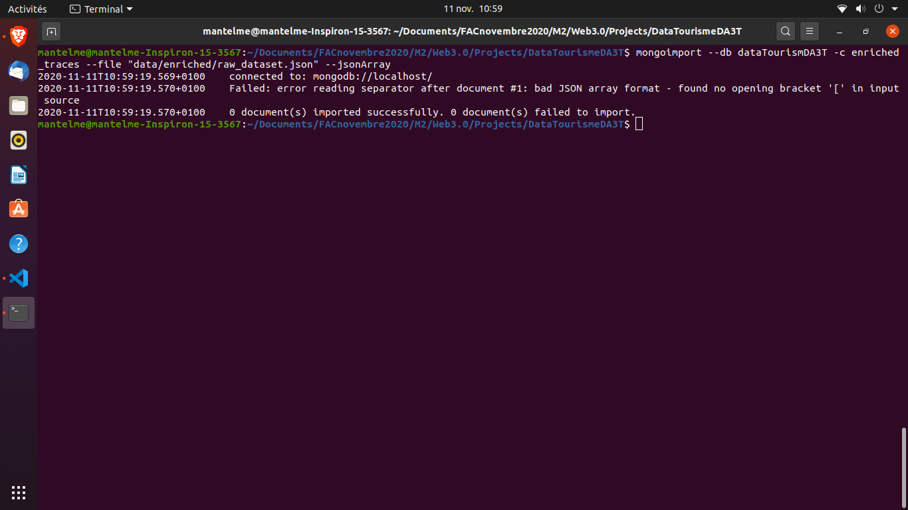
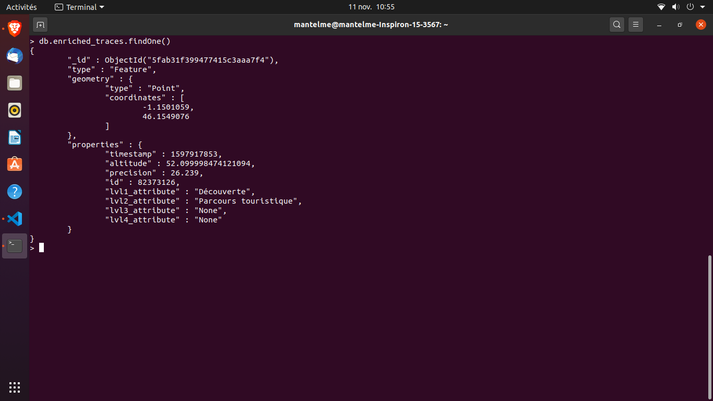

# WEB 3.0 - Données Touristique DA3T

### ANTELME Mathis

## Objectif du projet

> L'objectif de ce projet est de concevoir un outil de visualisation des traces enrichies sémantiquement dans le but de les éditer.

On attend les fonctionnalités suivantes:

1. **Chargement des traces** - Les traces sont disponibles au format *json*, cependant certaines traces ne sont pas valides (un `timestamp` négatif, les champs `id` et `id_user` sont équivalent, etc...);
2. **Sélection et affichage des traces** - L'outil devra permettre de sélectionner une ou plusieurs traces, puis de les afficher sur une carte de la ville de la Rochelle;
3. **Sélection et affichage de POI de la ville de la Rochelle** - Il s'agira de récupérer les **POI** (*Point of Interest*) de la Rochelle à partir d'une ontologie existante sur le web, puis, de les proposer à l'affichage;
4. **Sélection et affichage d'enrichissement sémantique des traces** - L'enrichissement sémantique s'organise en différents niveaux hiérachiques. L'outil devra permettre de sélectionner *un ou plusieurs* niveaux à afficher;
5. **Export PDF** - L'outil devra proposer un export au format **PDF**;

## Choix techniques

Pour la réalisation de ce projet j'ai décidé d'utiliser une application **Nodejs** qui utilisera les technologies suivantes:

- **[Leaflet](https://leafletjs.com/)** - Une bibliothèque légère et open-source qui permet de d'afficher des points, lignes, tracés et polygonnes sur une carte;
- **[MongoDB](https://www.mongodb.com/fr)** - Une base de donnée **NoSQL** rapide et facile à initialiser qui permettera de stocker les données des tracés au format **[GeoJSON](https://geojson.org/)**;
- **[Pug](https://pugjs.org/api/getting-started.html)** - Un système de patron qui permet de générer du **HTML** à la demande afin de gérer le front-end de l'application;

## Mise en place de MongoDB

Afin d'utiliser **MongoDB** pour stocker les données **GeoJSON**, nous devons tout d'abord l'installer comme [recommandé](https://docs.mongodb.com/manual/tutorial/install-mongodb-on-ubuntu/). Une fois cela effectué, on l'activera comme n'importe quel service puis on s'y connectera avec les commandes suivantes: 

```bash
sudo systemctl start mongod.service # mise en route du service
mongo --host 127.0.0.1:27017 # connection a mongoDB
```

Une fois connecté à **MongoDB**, on initialisera une base de données nommée `dataTourismDA3T` avec la commande ci-dessous:

```nosql
use dataTourismDA3T;
```

## Nettoyage des traces

Les données fournies pour ce projet (ici présentes dans le répertoire `./data`), ne sont pas utilisable dans leur état actuel. En effet, les tracés non-enrichis ne sont pas au format **GeoJSON**, et certaines des entrées ne sont pas valides. 

Avant de pouvoir incorporer ces données dans **MongoDB**, il nous font donc les nettoyer, puis les convertir en un format exploitable.

### Tracés enrichis (`./data/enriched`)

Ces données sont celles qui nécessitent le moins de traitement. En effet, elles sont déjà au format **GeoJSON**, cependant **MongoDB** considère que le document n'est pas valide (cf: Figure 1). 



Afin de corriger cela, nous allons utiliser l'utilitaire **[jq](https://stedolan.github.io/jq/)** qui permet, entre autres, de compacter le document et de le rendre compatible avec **MongoDB**. Pour cela on va utiliser la commande suivante:

```bash
jq --compact-output ".features" raw_dataset.json > ../cleaned/enriched_dataset.geojson
```

Suite à cela, l'importation des données dans **MongoDB** se fera sans soucis avec la commande suivante:

```bash
mongoimport --db dataTourismDA3T -c enriched_traces --file "../cleaned/enriched_dataset.geojson" --jsonArray
```

On pourra s'assurer de l'importation correcte des données en nous connectant à la base de données `mongo --host 127.0.0.1:27017` et en entrant les commandes suivantes qui vont permettre de nous connecter et d'afficher la première entrée dans la collection:

```nosql
use dataTourismDA3T;
db.enriched_traces.findOne();
```



### Tracés non-enrichis (`./data/raw`)

Les données des tracés non-enrichis sont celles qui nécessite un nettoyage et une transformation au format **GeoJSON**. Heureusement pour nous, ce format n'est rien d'autre que du **JSON** avec certaines spécifications. Dans notre cas, les points enregistrés par l'application mobile doivent être stockés sous la forme suivante:

```json
{
    "type": "FeatureCollection", // une collection d'objets JSON
    "name": "traces", // le nom de la collection qui permettera de l'identifier dans la BDD
    // le tableau des objets Feature représentant les points
    "features": [
        // un Point enregistré
        {
            "type": "Feature",
            // les coordonées GPS
            "geometry": {
                "type": "Point",
                "coordinates": [
                    lat,
                    lng
                ]
            },
            // les propriétés du Point
            "properties": {
                "trace_id": value, // l'identifiant de la trace qui permettera de relier chaque point
                "timestamp": value // ne doit pas être négatif
            }
        },
        {
            /* Prochain Point */
        }
    ]
}
```

Cependant les données doivent être nettoyées avant d'être transformées. En effet certains des `timestamps` sont négatifs, donc invalides, et une trace peut être identifiée par la clé `id` ou `id_user`. Nous devons donc renommer les clefs identifiant les traces en `id` afin de faciliter le traitement, puis sélectionner les objets donc les `timestamps` sont positifs.

Pour cela on va de nouveau utiliser `jq`:

```bash
.[] | with_entries( if .key | contains("id_user") then .key |= sub("id_user";"id") else . end) # permet de renommer les clefs 'id_user' en 'id'
| select(.timestamp>=0) # sélectionne uniquement les objets JSON dont le timestamp n'est pas négatif
```

Une fois ces données nettoyées, on peut les transformer avec `jq` et la syntaxe suivante (en assumant que vos données soient stockées dans `./data/raw/raw_dataset.json`):

```bash
jq '
{
    type:"FeatureCollection", 
    name:"raw_traces", 
    features:[
        .[] | select(.timestamp>=0) | with_entries( if .key | contains("id_user") then .key |= sub("id_user";"id") else . end) | 
        {
            type:"Feature", 
            geometry:{
                type:"Point", 
                coordinates:[
                    .latitude, .longitude
                ]
            }, 
            properties: {
                timestamp:.timestamp, 
                trace_id:.id
            }
        }
    ]
}
' ./data/raw/raw_dataset.json > ./data/cleaned/dataset.geojson
```

> Note: je n'ai personellement pas réussi a utiliser cette commande sur le fichier fournit du fait de sa taille, le process s'arrête avant (malgré le fait que la commande fonctionne sur des fichiers de plus petite taille). Cependant l'affichage des tracés enrichis s'effectue de la même manière que ceux qui ne le sont pas, j'effectuerai donc la suite du projet en utilisant les tracés enrichis;

Une fois ces données nettoyées et transformées, on peut les compacter comme pour les premières puis les importer dans **MongDB** sous la collection `bare_traces`.

```bash
jq --compact-output ".features" ./data/cleaned/dataset.geojson > ./data/cleaned/compacted_dataset.geojson # on compacte les données
mongoimport --db dataTourismDA3T -c bare_traces --file "./data/cleaned/compacted_dataset.geojson" --jsonArray
```

On pourra s'assurer de l'importation correcte des données en nous connectant à la base de données `mongo --host 127.0.0.1:27017` et en entrant les commandes suivantes qui vont permettre de nous connecter et d'afficher la première entrée dans la collection:

```nosql
use dataTourismDA3T;
db.bare_traces.findOne();
```

> Note: Le fichier étant trop conséquent et la transformation des données impossible le compactage et l'import des données décrit ci-dessus est purement théorique;

